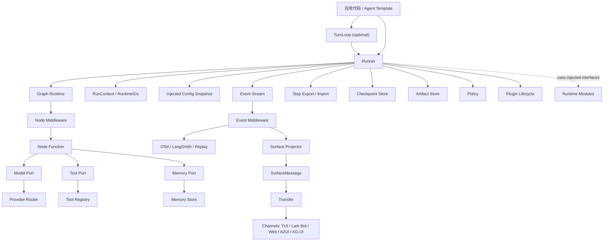
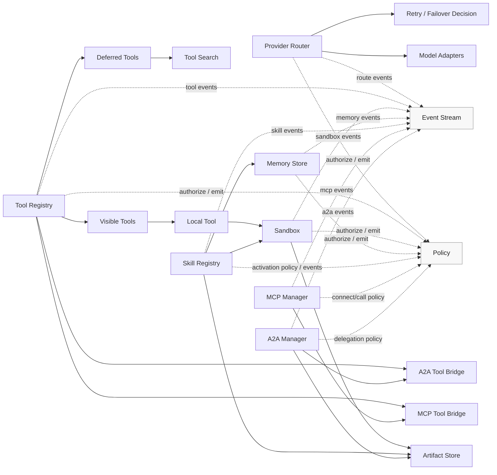
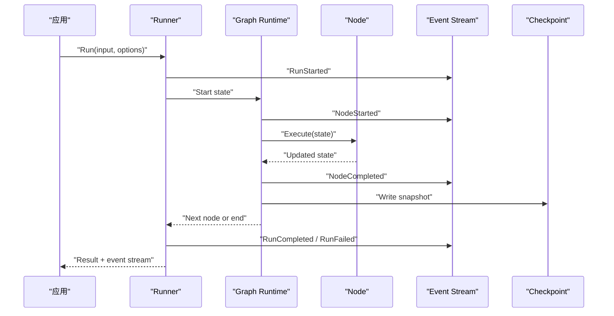
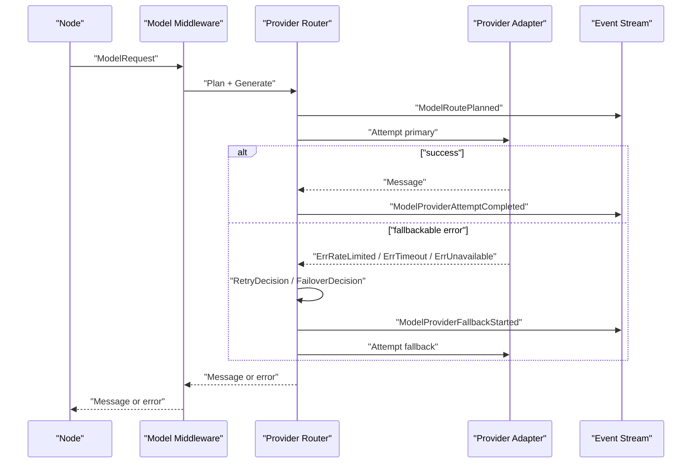
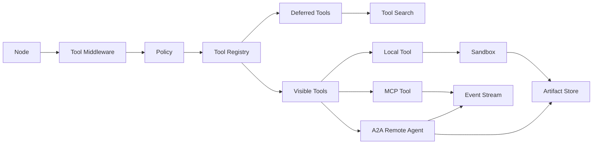
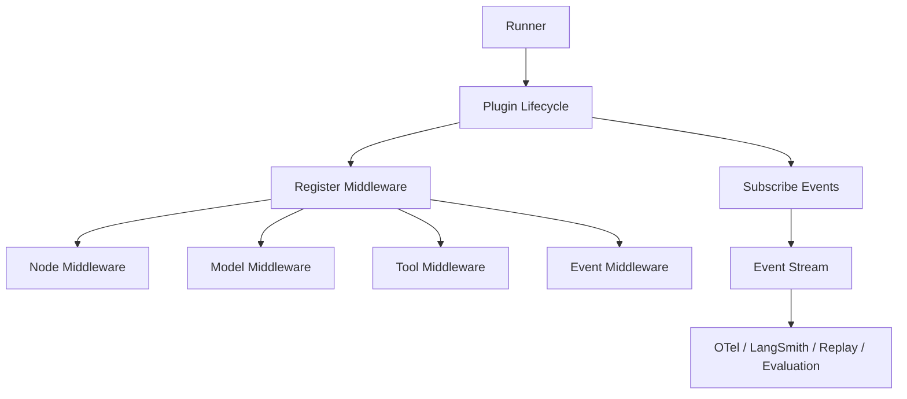
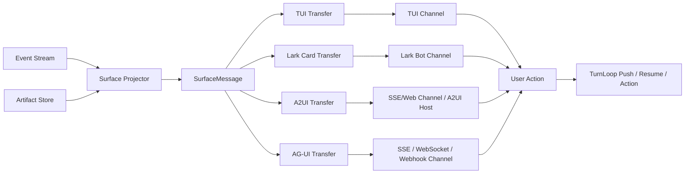

# gopact 总体设计

<!-- gopact:doc-language: zh -->

[英文文档](./index.md)

## 中文

日期：2026-06-23

本文是 `doc/design` 的入口。它把设计哲学、运行时模块、扩展性模型和后续 milestone 整合成一张完整地图。

## 结论

`gopact` 的核心不是某个 agent template，也不是某个模型 provider adapter，而是一套可观察、可恢复、可测试、可替换的 workflow/graph 过程契约。

最小可用 SDK/运行时由六层组成：

1. SDK user surface：`Setup`、`Defaults`、functional options、默认 logger、默认 clock/id/redactor/event sink。
2. foundational contracts：`Message`、`ContentPart`、`ToolSpec`、`ModelRequest`、`ModelRoute`、`Event`、`SurfaceMessage`、`Transfer`、`Channel`、`ChannelEvent`、`StepSnapshot`、`StepExport`、`CheckpointRecord`、`RuntimeIDs`、`ArtifactRef`、`PolicyRequest`、`PolicyDecision`、`ConfigVersion`。
3. execution spine：`TurnLoop`、`Runner`、event stream、graph execution、step export/import、checkpoint、cancel、interrupt/resume。
4. runtime modules：provider routing、tool registry、sandbox、memory、skill、MCP、A2A。
5. extension layer：hook、node/model/tool/event middleware、runner plugin。
6. adapter/template layer：model/memory/sandbox/MCP/A2A/channel adapters、transfer、plugins，以及 ReAct、Agent-as-Tool、Dev Agent 等 graph template。

ReAct、planner、supervisor、多 agent、deep-agent 都应该是这套运行时之上的 graph template，而不是隐藏执行顺序的不透明 agent class。

## 文档地图

| 文档 | 职责 | 何时阅读 |
| --- | --- | --- |
| [philosophy.md](philosophy.md) | 项目级设计原则、core 边界、Go API 取舍 | 判断一个 API 或模块是否应该进入 core |
| [why-gopact.md](why-gopact.md) | 对外定位、目标用户、差异化能力和脚手架目标 | 说明 gopact 为什么存在、主打什么、不主打什么 |
| [../../doc/FEATURES.md](../../doc/FEATURES.md) | core SDK 可执行能力覆盖矩阵，绑定每个核心能力的离线测试或 conformance 入口 | 判断功能点是否已有可运行验收，避免文档能力与测试脱节 |
| [agent-mesh.md](agent-mesh.md) | 垂域 agent 集群、自动发现、A2A 协作、RPC-like 调用体验和跨 agent evidence 目标 | 设计 agent 微服务化、agent cluster scaffold 或 A2A discovery 能力 |
| [self-bootstrap-roadmap.md](self-bootstrap-roadmap.md) | 推进到可自举 production-grade Agent SDK 的阶段目标、验收门槛和测试矩阵 | 规划自举路线、测试策略、release gate 和阶段完成标准 |
| [development-plan.md](development-plan.md) | M4 closure、M5 template、自举门槛、开源化发布手册和生产化研发计划 | 规划下一阶段开发、判断目标是否完成、准备公开发布 |
| [milestone-readiness.json](milestone-readiness.json) | M1-M6 的状态、证据文档、未完成项和自举级别清单 | 回答路线图是否完成、判断当前能进入哪一级自举 |
| [repository-boundary.json](repository-boundary.json) | 主仓内已出现的 adapter/template/harness 包归属：core、reference-only、外部 adapter/template repo 或 v1 前移除 | 审核新增包、拆仓计划、判断是否继续往主仓放生产 adapter |
| [public-api-boundary.json](public-api-boundary.json) | root 包顶层导出符号的分类、稳定性、来源文件和导出方法 receiver 继承策略清单 | 新增、移动或删除 root exported API 前检查 SDK public surface |
| [public-api-examples.json](public-api-examples.json) | root 包关键 SDK 入口的可执行 Example 覆盖契约 | 修改 setup、runner、export/resume、verification 等 root facade 调用形态前检查 |
| [deprecation-policy.md](deprecation-policy.md) | root public API 的稳定性、废弃标记、移除窗口和兼容性审查规则 | 废弃、移动、删除或改变 public API 语义前检查 |
| [versioning-policy.md](versioning-policy.md) | core SDK、schema 和外部 extension 的 semver、release gates 和兼容性策略 | 准备 release、调整 schema version、改变 extension contract |
| [migration-guide.md](migration-guide.md) | v1 前后的 public API、adapter split、checkpoint/resume 和 verification 迁移文档要求 | 准备 release、拆分 adapter/template 或迁移 checkpoint/resume schema |
| [ecosystem-topology.json](ecosystem-topology.json) | 官方仓库拓扑：`gopact` core、`gopact-ext` Go submodules、`gopact-examples` runnable examples；旧外部仓库 scaffold 仅保留为迁移历史 | 判断新增能力应进入 core、ext 还是 examples，避免重新拆成大量空壳仓库 |
| [v1-migration-plan.json](v1-migration-plan.json) | v1 前 core 边界收敛计划，覆盖主仓 move/remove 路径、extension 生态目标、transitional root API 目标状态和 `release_gate_checks`；每个 gate 声明 evidence type、来源 manifest、`required_check_ids`，CI 相关 gate 还声明 `required_ci_gates`（核心 CI 对齐 `core-ci-gates.json`，extension 生态 readiness 对齐 `extension-ecosystem-ci:gopact-ai` CI gate），并由测试证明可直接转成 `gopacttest.VerificationEvidenceRequirement`、Dev Agent release gate option 和 `ReleaseBundle` requirement | 判断 v1 前哪些 adapter/template/API 必须外迁、稳定、降级为 reference-only 或删除，以及 v1 release gate 应消费哪些证据 |
| [template-guide.md](template-guide.md) | 外部 graph template 的边界、step export/resume、events/verification、memory/side effect 和 conformance 要求 | 创建 ReAct、Dev Agent、Agent-as-Tool 或业务 template |
| [core-ci-gates.json](core-ci-gates.json) | core repo 自身的 whitespace、test、race、vet、lint、coverage、examples 和 security CI gate 清单，绑定 `.golangci.yml` 与 `coverage.out` | 修改 CI、Makefile、release gate 或 M6 验收标准前检查 |
| [external-integration-roadmap.json](external-integration-roadmap.json) | 生产级 provider/backend/channel/observability/transport/template 集成的 `gopact-ext` submodule 路线、`target_module` 和 scaffold-ready 状态 | 规划 OpenAI/Anthropic、GLM/BigModel、Z.AI、Volcengine Ark、Alibaba DashScope/Model Studio、Gemini/OpenRouter、models.dev catalog、Redis/SQL/S3/GCS/R2/OSS、A2UI/AG-UI/Lark/WebSocket、MCP/A2A transport、LangSmith/LangGraph、CI/model reviewer 等能力 |
| [external-repositories.json](external-repositories.json) | 旧外部 adapter/plugin/template 私有仓库初始化清单，标记为 `migration-history`，绑定 historical roadmap target repo、extension target、scaffold 文件和 CI 命令 | 审计既有外迁证据；新增官方 extension 应优先进入 `gopact-ext` |
| [extension-scaffold-spec.json](extension-scaffold-spec.json) | 旧外部仓库初始化蓝图，标记为 `migration-history`，定义通用 scaffold 文件规则、每个 repo 的 module path 和 extension target 初始 package path | 复核历史 scaffold evidence；当前官方拓扑以 `ecosystem-topology.json` 为准 |
| `internal/extensionscaffold` | legacy scaffold materializer，`LoadRepositoriesFromDesign` 从 `external-repositories.json`、`extension-conformance.json`、`extension-scaffold-spec.json` 和 `v1-migration-plan.json` 组装仓库计划与 v1 迁移责任，`WriteRepositoriesFromDesign` 批量写出 `<output>/<repo-name>` scaffold workspace，并在 README/CONFORMANCE 中渲染 `V1 Migration Ownership`，`RenderSyncPlanFromDesign` 生成私有仓库创建命令、文件清单、CI 命令和本地验证命令的机器可读远端同步计划，`RenderSyncScriptFromDesign` / `RenderSecretScriptFromDesign` / `RenderRerunScriptFromDesign` 生成可审查的 GitHub 同步、secret 配置和 CI rerun 脚本，`CheckRemoteRepositories` 输出远端 ready 状态、`not_ready_count`、`blocking_reasons` 和 `required_actions`，`RecordRemoteStatusCheck` 把已观察 `RemoteStatusReport` 转成标准 `external_repository_readiness` verification evidence，`RecordRemoteCIRunSetCheck` 把同一报告中的最新 Actions run 转成 `external-ci:gopact-ai` 跨仓 `ci_gate` verification evidence | 保留旧多仓 scaffold/release evidence；不作为新 extension 的默认创建路径 |
| [extension-conformance.json](extension-conformance.json) | `gopact-ext` module 与 legacy 外部 adapter/plugin/template 的兼容性目标、必跑 conformance suite、scaffold 文件、CI 命令和 examples 要求 | 建立或迁移 extension module、评估 extension 是否仍兼容当前 SDK |
| [extension-repository-template.md](extension-repository-template.md) | legacy 外部扩展仓库 README 模板，约束兼容矩阵、安装、用法、conformance、examples 和安全说明 | 复核旧 gopact-* adapter/plugin/template 仓库 scaffold evidence |
| [extension-conformance-template.md](extension-conformance-template.md) | legacy 外部扩展仓库 CONFORMANCE 模板，约束 target、required suites、CI commands、integration tags 和安全边界 | 复核旧 gopact-* adapter/plugin/template 仓库 scaffold evidence |
| [extension-ci-workflow.yml](extension-ci-workflow.yml) | 外部扩展仓库默认 GitHub Actions CI 模板 | 初始化外部扩展仓库或同步 CI gate |
| [api-ergonomics.md](api-ergonomics.md) | 调用体验、命名、option 分层、示例和 exported API review 清单 | 设计任何 public API 或 root facade |
| [contracts.md](contracts.md) | `Message`、`ContentPart`、`RuntimeIDs`、`Event`、`SurfaceMessage`、`Transfer`、`ChannelEvent`、`StepSnapshot`、`StepExport`、`CheckpointRecord`、`ArtifactRef`、`PolicyRequest`、`PolicyDecision`、`VerificationReport` / `VerificationRecorder` 等基础契约 | 实现 M1 或修改可持久化/可序列化类型 |
| [events.md](events.md) | 事件分类、顺序、stream API、redaction、sink 失败策略、channel/OTel 映射 | 设计 event stream、观测、replay、trajectory test |
| [checkpoint-resume.md](checkpoint-resume.md) | step export/import、checkpoint record、interrupt、resume、cancel-safe point、副作用幂等 | 设计任意中断后的恢复、HITL、TurnLoop、checkpoint store |
| [sdk.md](sdk.md) | SDK setup 入口、默认 logger、全局默认值、option 优先级和测试约束 | 设计 root package API、默认行为或全局 SDK 设置 |
| [config.md](config.md) | typed option 注入、snapshot version、热替换、secret provider、adapter/module/plugin 配置 | 接入 provider、sandbox、MCP、A2A、plugin、transfer 或 channel |
| [security.md](security.md) | 信任边界、policy、redaction、sandbox、MCP/A2A、skill、channel 安全规则 | 设计任何外部动作、数据外发或权限扩大 |
| [channels.md](channels.md) | `SurfaceMessage`、transfer、channel adapter、Lark/TUI/A2UI 等展示接入 | 接入新的展示位置、bot、TUI、Web 或 IM channel |
| [modules.md](modules.md) | provider routing、tool registry、sandbox、memory、skill、MCP、A2A 的契约和默认实现要求 | 设计运行时核心模块或 adapter |
| [extensibility.md](extensibility.md) | hook、middleware、plugin 的分层、生命周期、错误语义 | 设计可扩展点和横切能力 |
| [templates.md](templates.md) | ReAct、Agent-as-Tool、Dev Agent 等 graph template 的边界和测试要求 | 设计 agent template 或自举 agent |

研究依据：

| 文档 | 职责 |
| --- | --- |
| [../research/agent-sdk-landscape.md](../research/agent-sdk-landscape.md) | LangGraph、LangChain、Eino、Google ADK、A2UI、多 provider 生态调研 |
| [../research/harness-loop-engineering.md](../research/harness-loop-engineering.md) | Harness/loop/context/prompt engineering 的业务层启发、turn-control、MCP loop 风险、长周期质量退化调研 |

研发计划：

| 文档 | 职责 |
| --- | --- |
| [development-plan.md](development-plan.md) | 面向项目推进的总体研发计划、阶段验收、自举门槛和开源化发布手册 |
| [../superpowers/plans/2026-06-23-gopact-runtime-spine.md](../superpowers/plans/2026-06-23-gopact-runtime-spine.md) | M1 Runtime Spine 的任务拆解、测试顺序和提交计划 |
| [../superpowers/plans/2026-06-23-gopact-model-spine.md](../superpowers/plans/2026-06-23-gopact-model-spine.md) | M2 Model Spine 的 provider routing、fake provider 和 OpenAI-compatible adapter 实现记录 |
| [../superpowers/plans/2026-06-23-gopact-tool-sandbox-spine.md](../superpowers/plans/2026-06-23-gopact-tool-sandbox-spine.md) | M3 Tool and Sandbox Spine 第一段：tool registry、artifact store、本地/内存 sandbox |
| [../superpowers/plans/2026-06-23-gopact-integration-spine.md](../superpowers/plans/2026-06-23-gopact-integration-spine.md) | M4 Integration Spine 第一段：memory、skill、MCP、A2A 的契约和内存/假实现 |
| [../superpowers/plans/2026-06-23-gopact-turnloop-extensibility.md](../superpowers/plans/2026-06-23-gopact-turnloop-extensibility.md) | M4 控制面和扩展层第一段：TurnLoop、NodeContext middleware、PluginHost |

## 总体架构

Runner 不是一个“大容器”，也不拥有所有模块实现。它是一次 run 的编排器：接收应用输入，装配 graph、模块接口、事件流、checkpoint 和插件生命周期，然后推进执行。模块实现通过 Go options、typed snapshots 或接口注入，生产环境可以替换成 adapter。SDK 不读取配置文件；任何文件、环境变量或远程配置中心都属于应用层。

`TurnLoop` 位于 Runner 之上，负责多轮输入、抢占、取消和恢复。Runner 只执行一次 run；TurnLoop 决定什么时候启动、取消、恢复或合并下一次 run。这个分层避免 Runner 变成长期在线状态机。

Harness engineering、context engineering、loop engineering、prompt engineering 都属于业务层组装方法。它们可以指导 template 和应用设计，但不能下沉为 core 原子能力。Core 只沉淀更底层的过程契约：step 身份、step 输入输出、事件、checkpoint、artifact、policy、导出、导入和 resume。

SDK 必须保证 workflow/graph 面对任意中断都能落到稳定 step 边界。每个 step 完成后都应该可以导出 `StepSnapshot`，外部系统可以把 snapshot 导入另一个 runner 后继续执行。Code agent 可以在 step 里执行 patch/test/review，问答机器人可以在 step 里执行 retrieve/rank/answer，但二者共享同一套过程契约。

### Runner 编排图



架构边界：

- `TurnLoop` 是多轮控制面，负责输入合并、抢占、取消、恢复和下一轮调度；它不直接执行 node。
- `Runner` 是单次 run 组合点，负责把 graph、模块能力、事件、checkpoint、policy 和插件装配起来。
- `Graph Runtime` 只负责类型化状态流转、节点执行、边选择和 step 边界。
- `Step Export / Import` 是过程可迁移边界，负责把稳定 step 的输入、输出、状态、事件引用、副作用和 pending interrupt 打包成可导入快照。
- `Provider Router` 属于模型调用边界，负责多 provider、多模型、fallback、健康状态和预算控制。
- `Provider Router`、`Tool Registry`、`Sandbox`、`Memory`、`Skill`、`MCP`、`A2A` 是运行时核心模块，不是后置 plugin。
- `Event`、`SurfaceMessage`、`CheckpointRecord`、`ArtifactRef`、`PolicyRequest`、`PolicyDecision`、`ConfigVersion` 是基础契约；它们支撑所有模块，但不算业务运行时模块。
- `Middleware` 改变一次执行动作；`Plugin` 组合 runner 级横切能力；`Adapter` 接入外部系统。
- TUI、Lark bot、Web、A2UI、AG-UI 等属于 channel/transfer 层，消费 event stream、surface message 和 artifact refs；它们不是核心模块，也不能反向绑定 Runner。

### 模块依赖图



依赖规则：

- `Policy` 和 `Event Stream` 是共享横切能力，模块可以调用它们，但它们不能反向依赖具体模块。
- `Provider Router` 不依赖 graph、tool、sandbox、memory、MCP、A2A；它只依赖 provider adapter、模型能力目录、健康状态、policy 和事件。
- `Provider Router` 的 retry/failover 必须是显式 decision，而不是固定重试次数。Decision 可以读取失败 attempt 的输入、输出、错误、attempt 序号，并决定是否改写下一次输入或切换模型。
- `Tool Registry` 聚合本地工具、MCP tool bridge、A2A tool bridge；MCP/A2A 不是直接嵌进 graph，而是通过 tool 或 node adapter 暴露能力。
- `Tool Registry` 必须区分 visible tools 和 deferred tools。模型只能直接看到 visible tools；deferred tools 需要通过 tool search、skill activation 或 middleware 进入可见集合。
- `Sandbox` 只负责受控执行和文件边界，产物写入 `Artifact Store`；它不依赖 provider 或 memory。
- `Skill Registry` 可以使用 sandbox 执行脚本、读取 artifact 或写入 memory；如果 skill 声明 MCP server，应由 Runner/MCP Manager 完成连接，避免 skill 直接管理 MCP 生命周期。
- `Memory Store` 是长期记忆存取模块，不做自动模型抽取；抽取可以由 middleware/template 使用 provider router 后写入 memory。
- `A2A Manager` 可以产生 artifact，也可以把远程 agent 暴露为 tool/node adapter；它不能默认读取或发送本地 memory。

## 组件交互

### 多轮 TurnLoop 路径

```mermaid
sequenceDiagram
  participant App as "应用 / UI"
  participant Loop as "TurnLoop"
  participant Runner as "Runner"
  participant Checkpoint as "Checkpoint"
  participant Event as "Event Stream"

  App->>Loop: "Push(input)"
  Loop->>Runner: "Run(turn input)"
  Runner->>Event: "RunStarted"
  alt "higher priority input"
    App->>Loop: "Push(input, preempt=true)"
    Loop->>Runner: "Cancel current run"
    Runner->>Checkpoint: "Write cancel-safe checkpoint"
    Runner->>Event: "RunCanceled"
    Loop->>Runner: "Run(merged next input)"
  else "normal completion"
    Runner-->>Loop: "RunCompleted"
  end
  Loop-->>App: "Turn result / stream"
```

TurnLoop 要求：

- cancel 和 interrupt 是不同语义。cancel 是外部终止当前 run；interrupt 是业务流程主动暂停等待恢复输入。
- cancel 必须有安全点，取消失败可以升级，但不能悄悄丢 checkpoint。
- 恢复时，TurnLoop 要区分被中断的输入、尚未处理的输入和恢复后新输入。
- Runner 不维护长期输入队列；输入合并、去重、抢占都属于 TurnLoop。默认合并策略输出 `TurnInputBatch`，宿主可通过 `WithTurnInputMerge` 注入业务级合并策略。
- `TurnLoop.Close(ctx)` 是生命周期边界：它会取消 active turn，按 runner -> store 顺序关闭资源；成功资源幂等，失败资源可重试，后续 `Run` / `Push` 返回 `ErrTurnLoopClosed`。

### 一次 run 的主路径



主路径要求：

- 每个可观察行为都进入 event stream。
- step export 和 checkpoint 写入发生在稳定状态边界。
- error 保留 wrapping，支持 `errors.Is` / `errors.As`。
- `RuntimeIDs` 贯穿 run、node、model、tool、sandbox、memory、MCP、A2A。

### 模型调用路径



模型路径要求：

- model routing 和 provider routing 分开建模。
- retry/failover 由显式 decision 触发，不能只靠固定次数或字符串匹配。
- fallback candidate 必须满足硬能力和 policy。
- decision 可以改写下一次模型输入，但必须产生事件并保留 attempt 轨迹。
- 同一 `ThreadID` 默认保持 session stickiness。
- 流式输出开始后默认不自动切换，除非 adapter 能证明可恢复。

### 工具和外部能力路径



工具路径要求：

- tool call 必须经过 tool middleware 和 policy。
- 模型默认只看到 visible tools；deferred tools 只能通过搜索、skill 激活或 middleware 显式提升；模型驱动的 tool call 必须经过 model-visible invocation guard，不能因为模型猜中 deferred tool 名称就执行。
- 本地命令、脚本、文件访问必须经过 sandbox。
- MCP 是 agent-to-tool/data/prompt 边界。
- A2A 是 agent-to-agent task/artifact 边界。
- 远程返回的 tool suggestion 不自动执行，必须回到本地 policy。

### 扩展路径



扩展路径要求：

- hook 是生命周期时点，不是主要用户 API。
- middleware 作用在具体执行边界。
- plugin 只通过注册 middleware、订阅事件、管理生命周期影响运行时。
- plugin 不能直接修改 graph 分支、checkpoint 核心字段或业务 state。

### Channel / transfer 路径



Channel / transfer 要求：

- `SurfaceMessage` 是统一展示语义，agent/runtime 不直接输出 Lark card、TUI line 或 A2UI payload；
- transfer 只做格式转换，不读取 Runner 内部状态；
- channel adapter 负责投递、更新、删除和接收用户动作；
- 用户交互只能作为新的 input、resume payload 或受控 action 回到 TurnLoop；
- channel 可以通过 plugin 注册 transfer、事件订阅和生命周期；
- interrupt、tool call/result、streaming message、artifact update 必须能映射到 channel。

## 包和职责

```text
gopact
  message.go
  content.go
  tool.go
  model.go
  event.go
  ids.go
  step.go
  export.go
  logger.go
  setup.go
  options.go
  turnloop.go
  runner.go
  middleware.go
  plugin.go

graph
  graph.go
  stream.go
  middleware.go

checkpoint
artifact
policy
provider
tools
sandbox
memory
skill
mcp
a2a

adapters/channel/sse        # reference only
adapters/channel/tui        # reference only
adapters/storage/fileblob   # reference only

external adapter/plugin/template repos:
  gopact-adapters-model
  gopact-adapters-checkpoint
  gopact-adapters-turnloop
  gopact-adapters-lease
  gopact-adapters-storage
  gopact-adapters-channel
  gopact-adapters-transport
  gopact-plugins-observability
  gopact-templates-agenttool
  gopact-templates-devagent

templates/react
```

包边界规则：

- `gopact` root 只放跨模块核心契约和轻量 runtime facade。
- `Runner`、`TurnLoop`、middleware、plugin 的公开入口由 root package 暴露；早期不创建公开 `runner` 或 `turnloop` package。
- `graph` 保持类型化状态执行，不直接依赖具体 provider、sandbox、memory 后端。
- `artifact`、`policy`、`checkpoint` 是基础支撑 package；核心模块 package 定义 contract 和无外部依赖默认实现。
- adapter package 接入外部服务或格式转换，不反向污染 core contract。
- plugin package 管理横切能力，不承担业务编排。
- template package 只组合 graph/runtime，不定义新的执行语义。

## Milestones

模块清单是范围定义，不代表一次提交全部完成。实现需要按依赖顺序推进。

| Milestone | 目标 | 主要交付 | 自举状态 |
| --- | --- | --- | --- |
| M0: Design Baseline | 设计闭环 | `index.md`、哲学、核心契约、事件、checkpoint/resume、配置、安全、扩展性、模块、template 设计一致；README 指向设计入口 | 不能自举 |
| M1: Runtime Spine | 运行时可观察、可迁移 | API ergonomics examples、SDK `Setup`/defaults、默认 warn logger、`ContentPart`、`RuntimeIDs`、`RunContext`、`ConfigVersion`、`ArtifactRef`、`PolicyDecision`、`SurfaceMessage`、`StepSnapshot`、`StepExport`、`CheckpointRecord`、`graph.Run` event stream、node/step/checkpoint/error/cancel/interrupt 事件、event assertion helper | 不能自举，但可以用事件流验证 step 过程 |
| M2: Model Spine | SDK 能稳定调用模型 | `provider.Registry`、`provider.Router`、fake provider、openai-compatible adapter、model route events、`RetryDecision`、`FailoverDecision`、错误分类、typed `RouteSet`、基础 cost/token metadata；外部 adapter 目标优先 OpenAI/Anthropic native，再通过 OpenAI-compatible provider profile 覆盖 GLM/BigModel、Z.AI、Volcengine Ark、Alibaba DashScope/Model Studio、OpenRouter 和企业网关，并可选接入 models.dev catalog hint | 不能完整自举，但可以用 SDK 驱动模型生成设计草稿 |
| M3: Tool and Sandbox Spine | SDK 能安全执行 repo 内动作 | `tools.Registry`、visible/deferred tools、tool search、tool middleware、artifact store、sandbox local/memory、sandbox fail-closed profile wrapper、受限 file/shell tool、tool-call effect 第一片、`ToolResult.Commit` / `tools.CommitStore` replay commit ledger 第一片、`gopacttest/toolconformance` commit store adapter conformance helper、tool retry decision contract / middleware 第一片、effect graph/replay policy 契约第一片、step export 中的副作用记录第一片、跨 step effect graph 第一片、`SecretRef` / `SecretProvider` / `SecretValue` secret provider 原子契约、`NewPolicySecretProvider` secret resolve policy wrapper、`PromptInjectionGuardMiddleware` model inspect policy wrapper、`gopacttest/secretconformance` secret provider conformance helper、`gopacttest/promptinjectionconformance` detector conformance helper、基础安全测试 | 可以开始 Level 1 自举：只读分析、生成计划、运行受限测试；patch 生成/应用由当前运行模式决定 |
| M4: TurnLoop and Integration Spine | SDK 能处理多轮输入和外部能力 | `TurnLoop`、cancel/preempt、输入合并、恢复队列、skill registry、memory store、MCP client/server minimal、A2A client/server minimal、resource/prompt bridge | 可以开始 Level 2 自举：受控修改 docs、示例和测试；write mode 可 apply patch，plan mode 只输出 patch 建议 |
| M5: Agent Template and HITL | SDK 能跑真实开发 agent | ReAct graph template、Agent-as-Tool、Dev Agent template、interrupt/resume、human approval、trajectory tests、record/replay、run export、verification report、entropy audit、OTel/LangSmith plugin、TUI channel plugin | 可以开始正式自举：用 gopact agent 处理低风险 issue、文档、测试和 adapter 骨架 |
| M6: Production Hardening | SDK 可被外部项目采用 | adapter 分拆、CI gates、compat tests、security policy、versioning、examples、release docs | 可以扩大自举范围：实现 core 小特性，但 release、权限扩大和破坏性修改仍需人工审批 |

### 自举定义

这里的自举不是让 agent 无监督地改自己，而是让 `gopact` 运行一个基于自身 runtime 的开发 agent 来维护 `gopact` 仓库。

自举分三级：

- Level 1：只读分析和计划生成。可以读取 repo、跑测试、输出 patch 建议；plan mode 不 apply patch，write mode 也只允许用户显式放行的低风险写入。
- Level 2：受控写入。可以修改 docs、examples、tests 和 adapter 骨架；write mode 可以 apply patch，但每次写入必须有 event、checkpoint、diff 和人工确认，plan mode 只输出 patch 建议。
- Level 3：日常开发协作。可以实现低风险 core 变更，但必须经过 trajectory test、unit test、vet、review、run export、entropy audit 和人工 release gate。

最早可以开始自举的时间点是 M3 结束。M3 之前缺少安全执行边界和 tool policy，只能做普通模型调用，不能让 SDK 驱动开发任务。真正可作为日常开发助手使用的时间点是 M5 结束。

## 当前实现进度

当前代码已经完成 M1-M4 的第一批骨架切片，但还没有完成整个路线图。

已落地：

- M1 Runtime Spine：root 契约、`RuntimeIDs`、`ContentPart`、事件、`SurfaceMessage` / `ProjectSurfaceMessages`、`Transfer` / `TransferFunc`、`Channel` / `ChannelFunc`、`ChannelEvent` / `ResumeRequest` 转换、channel 诊断事件常量、`StepSnapshot`、`StepExport`、root `WithStepExport` / `WithResumeRequest` / `WithJSONSchemaValidator` 运行选项、root `JSONSchemaValidator` / `JSONSchemaValidatorFunc` 可插拔 schema validator 契约、root `ValidateJSONSchemaValue` / `ValidateJSONSchemaValueWith` / `ErrJSONSchemaValidationFailed` portable schema subset 原语、root `ValidateResumePayload` / `ValidateResumePayloadWithValidator` / `ErrResumePayloadInvalid` resume payload schema gate（pattern、exclusive bounds、multipleOf 第二片）、`RunExport`、`RunExportJSONSchema`、`RunRecorder`、`ReplayRunExport`、`TaskRecord` / `InputRecord` / `InterventionRecord` / `FailureAttribution` process records、failed verification report -> `FailureVerification` 归因第一片、`EntropyAudit` / `EntropyFinding` audit records、run-level `VerificationReport` / `VerificationRecorder` 第一片、`Runner` facade、`graph.Run` event stream、checkpoint hook/loader/store、checkpoint codec/integrity 第一片、checkpoint migration/config drift 第一片、本地 file checkpoint store 第一片、row checkpoint store 端口第一片、object checkpoint store 端口第一片、completed/interrupted/canceled `StepExport` resume 第一片、checkpoint latest load 第一片、interrupted step/checkpoint resume 时 `ResumeSchema` 校验第一片、`StepImported` / `CheckpointLoaded` / `ResumeReceived` / `NodeResumed` 恢复事件、`WithArtifactVerifier` 接入 step import/checkpoint load、导入事件携带 effect replay plan、root `EventEffectReplayPlan` 类型化 helper、event 与 trajectory 测试辅助，以及 run export / model call / tool call / failure attribution / policy decision / trajectory golden / command result / `gopacttest.RecordCIGateSuiteCheck` ci_gate suite / `gopacttest.RecordCIRunCheck` remote CI run / `gopacttest.RecordCIRunSetCheck` cross-repository remote CI run set / internal external repository readiness / file snapshot / observed diff / checkpoint record / reviewer decision / entropy audit verification evidence 桥接。
- M1 runtime identity hardening：`RunRecorder` 的 `RunExport.IDs` 只汇总 run-scope stable identity（user/session/thread/run/agent/app/trace），拒绝这些字段在同一 recorder 内漂移；`CallID` / `ParentCallID` 保留在具体 event、step 或 process record 上，避免模型/工具/A2A 等调用级身份污染 run export 顶层身份。
- M2 Model Spine：provider registry/router、route set、fallback/error classification、model middleware、fake provider、OpenAI-compatible adapter、model route events；外部 model adapter 目标优先 OpenAI/Anthropic native，再通过 OpenAI-compatible provider profile 覆盖 GLM/BigModel、Z.AI、Volcengine Ark、Alibaba DashScope/Model Studio、OpenRouter 和企业网关，并可选接入 models.dev catalog hint。
- M3 Tool and Sandbox Spine：visible/deferred tool registry、tool search/promotion、direct invocation、model-visible invocation guard、tool middleware、scope metadata 进入 tool policy request、tool-call effect 第一片、`ToolResult.Commit` tool 幂等提交契约第一片、`tools.CommitStore` replay commit ledger 插槽和内存参考实现、`gopacttest/toolconformance.CheckCommitStoreConformance` / `RequireCommitStoreConformance` 外部 commit store adapter 合规测试 helper、tool retry decision contract / middleware 第一片、tool-call replay handler 第一片、effect graph/replay policy 契约第一片、`PlanEffectReplay` 单步 runtime plan 第一片、`BuildRunEffectGraph` 跨 step effect graph 第一片、`PlanRunEffectReplay` run-level plan 第一片、`EffectReplayRegistry` handler 分发第一片、`ExecuteEffectReplay` / `ExecuteRunEffectReplay` executor 第一片、step-level 和 run-level effect replay verification evidence 桥接第一片、artifact store、artifact integrity verifier 第一片、artifact integrity verification evidence 桥接第一片、artifact_write replay verify handler 第一片、本地 allowlist sandbox、内存 sandbox、`sandbox.Profile` / `sandbox.ProfileManager` fail-closed profile wrapper 第一片、sandbox exec verification evidence 桥接第一片、sandbox_exec / sandbox_file_read / sandbox_file_write replay handler 第一片、root `SecretRef` / `SecretProvider` / `SecretValue` secret provider 原子契约第一片、root `NewPolicySecretProvider` secret resolve policy wrapper 第一片、root `PromptInjectionGuardMiddleware` model inspect policy wrapper 第一片、`gopacttest/secretconformance.CheckSecretProviderConformance` / `RequireSecretProviderConformance` 外部 secret provider 合规测试 helper、`gopacttest/promptinjectionconformance.CheckPromptInjectionDetectorConformance` / `RequirePromptInjectionDetectorConformance` 外部 prompt-injection detector 合规测试 helper，以及基础安全测试。
- M4 Integration Spine：memory、memory policy store wrapper、memory_put / memory_delete / memory_search / memory_extract replay handler 第一片、memory replay verification evidence 桥接第一片、skill、skill filesystem registry loader 第一片、skill registry/resource/script policy wrapper 第一片、skill local resource reader、sandbox script runner、MCP-like manager/client、MCP newline JSON-RPC client/transport 第一片、MCP newline interleaved server-to-client request handler、MCP newline notification handler、MCP Streamable HTTP POST + JSON/SSE response transport 第一片、MCP POST request-scoped SSE resume、MCP Streamable HTTP GET listen stream、MCP HTTP/SSE interleaved server-to-client capability request dispatch、MCP HTTP/SSE notification handler、MCP URL-mode elicitation completion notification handler 第一片、continuous listen reconnect/retry、session/protocol header、DELETE session termination 与 404 session-expired 处理第一片、MCP sampling/elicitation handler contract、policy wrapper 与 `CapabilityServer` JSON-RPC dispatch 第一片、MCP `ToolServer` server adapter 第一片、MCP manager/client policy wrapper 第一片、A2A registry/fake agent/local runnable agent adapter/HTTP JSON-JSONL wrapper/JSON-RPC 2.0 + SSE wrapper/cancel/message/artifact/status stream/discovery/auth context 第一片、A2UI v0.9 JSON message transfer/JSONL channel/history replay/schema catalog validation/复用 root schema validator 且支持 `ValidatorConfig.SchemaValidator` 注入的 component validation/client-supported catalog negotiation/in-memory reference renderer/action decode 第一片、AG-UI event transfer/HTTP SSE channel 第一片、`TurnLoop`、`TurnInputMergeFunc` / `WithTurnInputMerge` 业务级输入合并策略第一片、resume request 透传、TurnLoop interrupted resume schema gate 第一片、`WithTurnJSONSchemaValidator` 自定义 schema validator 注入和 TurnLoop resume policy gate/event 第一片、`TurnLoopStore` 持久化第一片、内存/本地 file/row/blob/versioned CAS TurnLoop store、TurnLoop database/sql row/versioned CAS backend 第一片、TurnLoop HTTP/JSON control-plane row/versioned CAS backend 第一片、TurnLoop Redis GET/SET/EVAL row/versioned CAS backend 第一片、TurnLoop conditional object versioned CAS backend 第一片、`NewLeasedTurnLoopStore` worker ownership wrapper、后台续约和 `LeaseObserver` 争用/续约观测第一片、`github.com/gopact-ai/gopact-adapters-lease/sqlstore` database/sql lease backend 第一片、`github.com/gopact-ai/gopact-adapters-lease/redisstore` Redis lease backend 第一片、`github.com/gopact-ai/gopact-adapters-lease/httpstore` HTTP/JSON control-plane lease backend 第一片、`adapters/lease/objectstore` conditional object lease backend 第一片、sandbox policy manager/session wrapper、artifact policy store wrapper、trace HTTP/JSON exporter、trace OTLP/HTTP JSON exporter、LangSmith-compatible HTTP run exporter、LangGraph-style HTTP event exporter、trace exporter policy wrapper 第一片、`PolicyChannel` 第一片、`NodeContext`、`EventContext`、`ModelContext`、`ToolContext`、`PluginHost`、`PluginDescriptor` / `PluginCapability`、plugin subscriber strict/fallback、`AsyncEventSink`、plugin lifecycle 状态机、幂等 close、close-while-running 等待、`graph.WithNodeMiddleware`、Runner/provider/tools middleware 接入、`EventSinkMiddleware` strict/fallback 第一片、model/tool policy middleware、model I/O redaction middleware 第一片、model rate limit middleware 第一片、tool result redaction middleware 第一片、policy requested/decided events、review-to-approval interrupt、event redaction middleware、`Event.Redaction` 状态、root interrupt/resume 契约、completed/interrupted/canceled checkpoint queue/pending 持久化、TurnLoop pending/resume queue 第一片、`StepSnapshot.Effects` 第一片、Runner/TurnLoop close 第一版。
- M5 Agent Template 第一片：`templates/react` 已支持最小 model/tool loop、可选 memory recall 注入、显式 memory extractor 同步写入、宿主注入 memory merge hook、deferred memory write effect、deferred memory extract request effect、`memory_extract` replay handler、`RunExport` -> pending memory work planner/executor、`RunDeferredMemoryWork` 单次 worker pass report contract、`NewMemoryDeferredMemoryWorkQueue` 本地内存队列、`NewMemoryDeferredMemoryWorkQueueWithVisibilityTimeout` 本地 visibility timeout reference（通过 `DeferredMemoryWorkJob.DeliveryID` 表达单次 receipt，不污染业务 `Metadata` / snapshot / transition records）、`gopacttest/reactconformance` 基础 queue conformance helper（含 retry 保留 job metadata 并合并 decision metadata、concurrent dequeue 不重复分发同一 job）和 visibility queue conformance helper、`NewDeferredMemoryWorkRetryDecider` 默认有界 retry/backoff 调度决策器、`DeferredMemoryWorkWorker.RunOnce` queue worker executor 且默认接入 retry/backoff decider、`WithDeferredMemoryWorkLease` RunOnce ownership gate、`WithDeferredMemoryWorkLeaseRenewalInterval` pass-local lease renewal、`DeferredMemoryWorkWorker.Drain` 显式 limit 有界 drain loop、`RecordDeferredMemoryWorkCheck` -> `memory_replay` evidence bridge、`RecordDeferredMemoryWorkScheduleCheck` -> `memory_work_schedule` retry/stop/dead-letter decision evidence bridge、completed step snapshot、completed `call_model` / `call_tool` `StepExport` 恢复继续、`WithCheckpointStore` 持久化 completed model/tool checkpoint 并按 `ThreadID` resume、tool approval interrupted checkpoint + `ResumeRequest` 恢复继续、tool approval interrupt/resume snapshot、多 tool 批次 resume 跳过已完成工具、通过 streaming model adapter 消费 provider fallback events、tool artifact refs 进入 events/run export、`RunRecorder` run export stable/interrupted steps、model/tool/policy failure attribution、entropy audit records、可选 `WithVerifier` verify node、`VerificationReport` gate、run-level verification report、候选 `RunExport` 自动填充 template task / run input / resume input / resolved intervention process records，以及 direct final / tool-then-final / multi-tool-then-final / multi-tool-error / max iterations loop guard / unpromoted deferred tool rejection / tool error / missing tool registry / verifier passed report / verifier failed report / verifier error / tool artifact result / step export artifact import / checkpoint artifact import / artifact verifier failure / completed model step export resume / completed tool step export resume / completed model checkpoint resume / completed tool checkpoint resume / memory recall / memory write / memory merge / memory deferred write / memory deferred extract / provider fallback / approval interrupt / policy deny / approval step resume / multi-tool pending resume / interrupted checkpoint resume golden trajectory fixtures；`github.com/gopact-ai/gopact-templates-agenttool/agenttool` 已支持 A2A card/tool spec 互转、本地 runnable 转 tool、远程 `a2a.Agent` 转 tool、discovered card spec、sanitized auth context、parent/child call chain 透传、child events、A2A task events、A2A send/cancel policy gate、send timeout、cancel event、streaming message/artifact/status events、A2A stream golden trajectory fixture 和 artifact refs 返回；`github.com/gopact-ai/gopact-templates-devagent/devagent` 已支持 mode/action gate、entropy audit collector、reviewer plugin slot、release gate contract、release gate evidence bridge、process record bridge 和 release evidence bundle，约束 analyze/plan/write 下的 patch proposal、patch apply、review 和 release 证据，write apply 必须带 policy allow decision、sandbox event、observed diff 和 observed checkpoint ref，消费 patch metadata、unified diff header、verification report、entropy audit 和 reviewer decision 来决定 write-mode release 是否可通过，并允许调用方通过 `RequireCheckIDs` 要求指定 verification checks 存在且 passed，通过 `RequireEvidenceTypes` 要求 run_export、model_call、tool_call、channel_event、effect_replay、run_effect_replay、memory_replay、memory_work_schedule、policy_decision、ci_gate、diff、file_snapshot、checkpoint、checkpoint_objectstore_index、trajectory、failure_attribution、entropy_audit 等已观察 evidence type，通过 `RequireCIGates` 要求指定 `ci_gate` evidence 已 passed；`BuildProcessRecords` / `RecordProcessRecords` 可把已观察 action、sanitized patch summary、release gate 和 reviewer decision 转成 `RunRecorder` task/input/intervention process records，且不保存 raw diff；`BuildWorkflowProcessRecords` / `RecordWorkflowProcessRecords` 可把一组已观察 action boundary 汇总成 workflow 父 task、子 action task、input 和 intervention records，父 task output 会保留稳定 child action summary，并通过 `workflow_id` / `workflow_action_index` / `workflow_action_count` / `workflow_task_id` 保留稳定顺序和 child task 归属，同时子 action 会继承 workflow runtime identity 且拒绝显式冲突的 run/user/session/thread/agent/app/call/trace 等字段；`WorkflowActionProcessRecords` 可按 1-based `workflow_action_index` 提取单个 child action 的 task/input/intervention process records，并只返回同 action index 且 `workflow_task_id` 对齐的边界 defensive copy；`BuildReleaseBundle` / `ReleaseBundle` 可把已观察 run export、verification report、entropy audits、review decision、passed gate 和 sanitized process records（可通过 `WorkflowActionProcessRecords` 生成或通过 `ReleaseBundleInput.Process` 显式传入已观察 workflow child process records）打包成 release-ready evidence bundle，并校验 run/report/gate/process/required evidence、required CI gates、runtime identity、run export 内嵌 report/process snapshots 和 review/gate/process 摘要对齐；当 process task 来自 workflow child 时，会拒绝混入其他 `workflow_action_index` 的 input/intervention 边界；构建时会防御性拷贝 `RunExport`，避免宿主后续 mutation 污染已封存证据；`RecordReleaseBundleCheck` 可把校验通过的 bundle 转成标准 `release_bundle` evidence，并保留 reviewer、gate 摘要、required CI gates 和 process/gate/resume/review boundary id，调用方 metadata 不能覆盖 canonical release evidence 字段；`RecordRunExportCheck` 可把已观察且非空的 completed `RunExport` 转成标准 run export evidence，调用方 metadata 不能覆盖 outcome/count/runtime ids 等 canonical run export 字段；`RecordModelCallCheck` 可把已观察模型请求/响应/错误转成标准 model call evidence 且不保存 raw prompt/response text，`RecordToolCallCheck` 可把已观察工具请求/结果/错误转成标准 tool call evidence 且不保存 raw args/result content，`RecordPolicyDecisionCheck` 可把已观察 policy request/decision 转成标准 policy evidence，`RecordEffectReplayCheck` 可把已观察 step-level replay plan/results/error 转成标准 effect replay evidence，`RecordRunEffectReplayCheck` 可把已观察 run-level replay plan/results/error 转成标准 run effect replay evidence，`RecordEntropyAuditCheck` 可把已观察 `EntropyAudit` 转成标准 entropy audit evidence；这些 root/replay/checkpoint/gopacttest/devagent/objectstore evidence bridge 的调用方 metadata 只能补充非保留字段，不能覆盖 ref、计数字段、runtime ids、状态、错误和 shape 摘要等 canonical evidence 字段；`RecordReleaseGateCheck` 可把已评估 `GateResult` 转成标准 release gate evidence，调用方 metadata 不能覆盖 canonical release gate 字段；`github.com/gopact-ai/gopact-templates-devagent/gitdiff` 已在外部仓接管 worktree/staged git diff scanner 第一片，把 git diff 转成 diff snapshot 和 patch proposal；`github.com/gopact-ai/gopact-templates-devagent/channelreview` 已支持可选投递 `SurfaceMessageApproval` review prompt，并从统一 `ChannelEvent` action stream 提取 approve/reject review decision，把 Lark/TUI/SSE/CI 等外部审批入口接入 Dev Agent release gate；`github.com/gopact-ai/gopact-templates-devagent/cireview` 已支持从已观察 `VerificationReport`、required checks 和 `EntropyAudit` 产出 CI reviewer decision；`github.com/gopact-ai/gopact-templates-devagent/modelreview` 已支持通过宿主注入 `gopact.ChatModel` 产出显式 JSON model reviewer decision，并可通过 `WithGovernance` 保留 prompt/eval/policy metadata；`github.com/gopact-ai/gopact-plugins-observability/trace` 已支持 provider-neutral trace plugin、HTTP/JSON exporter、OTLP/HTTP JSON exporter、LangSmith-compatible HTTP run exporter、LangGraph-style HTTP event exporter 和 exporter policy wrapper，把 runtime events 投影成 span records，供后续真实 LangSmith SDK 和 LangGraph-style policy/redaction 深化复用。
- M5 run export evidence metadata hardening：`RecordRunExportCheck` 在 check metadata 和 `run_export` evidence metadata 两层保留调用方非保留补充字段，并暴露非保留补充 metadata key 摘要，同时拒绝覆盖 ref、run export version、outcome、计数、created_at、runtime ids 和 `metadata_keys` 等 canonical run export 字段，避免 verification check 摘要与 evidence 条目漂移。
- M5 model call evidence metadata hardening：`RecordModelCallCheck` 在 check metadata 和 `model_call` evidence metadata 两层保留调用方非保留补充字段，并暴露 request/response metadata key 摘要，同时拒绝覆盖 ref、request/route/usage、消息/工具/能力计数、runtime ids、request/response metadata 与 key summary、输出角色/工具调用、错误和 skipped 等 canonical model call 字段，避免 model call check 摘要与 evidence 条目漂移。
- M5 tool call evidence metadata hardening：`RecordToolCallCheck` 在 check metadata 和 `tool_call` evidence metadata 两层保留调用方非保留补充字段，并暴露 result metadata key 摘要，同时拒绝覆盖 ref、argument/result bytes、artifact/effect/event count、runtime ids、tool call id/name、result metadata 与 key summary、error 和 skipped 等 canonical tool call 字段，避免 tool call check 摘要与 evidence 条目漂移。
- M5 review/failure attribution evidence metadata hardening：`gopacttest.RecordReviewCheck` 和 `RecordFailureAttributionCheck` 在 check metadata 与对应 evidence metadata 两层保留调用方非保留补充字段，并暴露非保留 metadata key 摘要，同时拒绝覆盖 reviewer/status/source、failure kind、runtime ids、错误、计数和时间等 canonical evidence 字段，避免 review / failure attribution 证据被外部 metadata 伪造或漂移。
- M5 channel event evidence metadata hardening：`RecordChannelEventCheck` 在 check metadata 和 `channel_event` evidence metadata 两层保留调用方非保留补充字段，同时拒绝覆盖 ref、runtime ids、channel/event/action identity、text/payload shape、metadata key 摘要、错误和 skipped 等 canonical channel event 字段，避免 channel callback / approval evidence 摘要与 evidence 条目漂移。
- M5 effect replay evidence metadata hardening：`RecordEffectReplayCheck` 和 `RecordRunEffectReplayCheck` 在 check metadata 与 `effect_replay` / `run_effect_replay` evidence metadata 两层保留调用方非保留补充字段，并暴露非保留补充 metadata key 摘要，同时拒绝覆盖 ref、decision/replay/skip/result count、step/run identity、planned/result effect ids、planned/result step ids、错误、mismatch 和 `metadata_keys` 等 canonical replay 字段，避免 resume/replay check 摘要与 evidence 条目漂移。
- M5 entropy audit evidence metadata hardening：`RecordEntropyAuditCheck` 在 check metadata 和 `entropy_audit` evidence metadata 两层保留调用方非保留补充字段，并暴露非保留补充 metadata key 摘要，同时拒绝覆盖 ref/audit id、audit status、finding count、runtime ids、created_at、max severity、findings 摘要和 `metadata_keys` 等 canonical entropy 字段，避免 release gate 读取 entropy evidence 时被外部 metadata 伪造或漂移。
- M5 CI gate evidence metadata hardening：`gopacttest.RecordCIGateSuiteCheck`、`gopacttest.RecordCIRunCheck` 和 `gopacttest.RecordCIRunSetCheck` 在 check metadata 与每条 `ci_gate` evidence metadata 两层保留调用方非保留补充字段，并暴露非保留补充 metadata key 摘要，同时拒绝覆盖 gate、status、provider/repository/workflow/run/job/step、required gate/repository、聚合计数、URL、commit 和时间等 canonical CI 字段，避免 release/readiness gate 被外部 metadata 伪造或漂移。
- M5 base evidence bridge metadata hardening：`memory.RecordReplayCheck`、`templates/react.RecordDeferredMemoryWorkScheduleCheck`、`checkpoint.RecordVerificationCheck`、`objectstore.RecordIndexConsistencyCheck`、`sandbox.RecordExecCheck`、`gopacttest.RecordCommandCheck`、`gopacttest.RecordDiffCheck` 和 `gopacttest.RecordFileSnapshotCheck` 在 check metadata 与对应 evidence metadata 两层保留调用方非保留补充字段，其中 memory replay、memory work schedule、checkpoint、checkpoint objectstore index、sandbox exec、command、diff 和 file snapshot 会暴露非保留补充 metadata key 摘要；这些 bridge 同时拒绝覆盖 replay/checkpoint/sandbox/command/diff/file snapshot 的 canonical ref、计数、runtime ids、相关 replay 的 planned/result effect ids 与 planned/result step ids、命令、状态、错误、shape 摘要和 `metadata_keys` 字段，避免基础验证证据在 report、release gate 和 bundle 中出现摘要漂移。
- M5 Dev Agent process metadata：`EvaluateAction` 会防御性复制 action metadata，`BuildProcessRecords` / `BuildWorkflowProcessRecords` 会把 prompt/eval/policy governance ref 贯穿到 child task/input/intervention metadata；SDK canonical 字段仍覆盖冲突键，避免外部 metadata 改写 action、mode、status 或 workflow 顺序。
- M5 Dev Agent interrupted process records：`github.com/gopact-ai/gopact-templates-devagent/devagent.BuildProcessRecords` 已支持 `ActionInterrupted` + `GatePending`，把等待人工 approval 的 release gate 记录成 `TaskInterrupted`、`devagent.release_gate` input 和 `InterventionRequested` approval request；`BuildWorkflowProcessRecords` 会单独汇总 `interrupted_action_count`，在无失败但存在中断 action 时让 workflow 父 task 进入 `TaskInterrupted`，不把可恢复暂停误标成 completed 或 failed。
- M5 Dev Agent canceled process records：`github.com/gopact-ai/gopact-templates-devagent/devagent.BuildProcessRecords` 已支持 `ActionCanceled`，把外部 context canceled / 用户取消的 action 记录成 `TaskCanceled`；`BuildWorkflowProcessRecords` 会单独汇总 `canceled_action_count`，在无失败或中断但存在取消 action 时让 workflow 父 task 进入 `TaskCanceled`，不把主动取消误标成 failed。
- M5 Dev Agent resume process records：`github.com/gopact-ai/gopact-templates-devagent/devagent.BuildProcessRecords` 已支持 `ResumeRequest`，把外部审批恢复动作记录成 `devagent.review_resume` / `InputResume` process input，并把同一 resume defensive copy 挂到 resolved/rejected review intervention；workflow process conformance 会拒绝 resume input 与同 action review intervention resume 任一方向孤立的导入记录；self-bootstrap resumed release golden trajectory 已把 `StepImported` -> `ResumeReceived` -> `NodeResumed` -> `RunCompleted` 的恢复过程、release workflow process records 和 release bundle resume boundary 固定下来；self-bootstrap resumed apply release golden trajectory 已进一步把 interrupted apply step import、approval resume、resumed policy/sandbox evidence、apply process records 和 release bundle 固定到同一条可封存轨迹。
- M5 Dev Agent resume summary refs：`github.com/gopact-ai/gopact-templates-devagent/devagent.BuildWorkflowProcessRecords` 会在任何带 `devagent.review_resume` / `InputResume` 的 child action summary 中保留 `resume_input_id`，并在任何带 approval review intervention 的 child action summary 中保留 `review_intervention_id`；`CheckWorkflowProcessConformance` 会对账 summary、resume input 和同 action review intervention，让 apply/release 等可恢复 step 不必解析完整 child records 也能从 workflow 父摘要定位恢复边界；当 release bundle 来自 workflow child 时，`CheckReleaseBundleConformance` 也会对账 release summary 的 `resume_input_id` 与 bundle process 中的 resume input，避免封存 evidence 与父 workflow 摘要漂移。
- M5 model reviewer governance hardening：`github.com/gopact-ai/gopact-templates-devagent/modelreview` 会把 prompt/eval/policy governance metadata 写入模型请求和 reviewer decision，但不会允许 governance metadata 或模型返回 metadata 覆盖 request canonical `adapter` / `purpose` 字段，也不会允许 decision 的 canonical `adapter=modelreview` 被伪装，便于后续 release evidence 审计来源。
- M5 channel reviewer governance hardening：`github.com/gopact-ai/gopact-templates-devagent/channelreview` 会把 channel、event 和 action 身份转成 reviewer decision metadata，但不允许外部 event/action metadata 覆盖 canonical `adapter` / `channel` / `event_id` / `action_id`，普通补充字段仍按 action metadata 覆盖 event metadata 的顺序合并，便于 TUI、Lark、SSE、CI callback 等外部审批入口统一进入 release gate。
- M5 Agent-as-Tool approval boundary：A2A send/stream/cancel policy review 都会在远程动作执行前返回 approval interrupt；approval interrupt id 会携带 `:a2a:<action>`，避免同一 parent/child call 下 send/stream/cancel review 的 resume id 冲突；A2A auth 会在 send/stream/cancel 的 policy 和 remote action 之前注入，policy requested/decided event、send completed/failed event、stream completed/failed/canceled event（含 unsupported failed event）、stream completed `Event.Result.Metadata`、cancel canceled/failed event 与 tool result metadata 都会保留 sanitized auth audit 字段。
- M5 release gate evidence metadata hardening：`github.com/gopact-ai/gopact-templates-devagent/devagent.RecordReleaseGateCheck` 会在 check metadata 和 evidence metadata 两层保留调用方非保留补充字段并暴露非保留补充 metadata key 摘要，同时拒绝覆盖 canonical `gate_status` / `ref` / `mode` / `report_status` / `max_entropy_severity` / `review_status` / `reasons` / `metadata_keys` 字段，避免 release gate 证据摘要和 evidence 条目漂移。
- M5 release bundle evidence metadata hardening：`github.com/gopact-ai/gopact-templates-devagent/devagent.RecordReleaseBundleCheck` 会在 check metadata 和 `release_bundle` evidence metadata 两层保留调用方非保留补充字段并暴露非保留补充 metadata key 摘要，同时拒绝覆盖 version、runtime ids、mode/outcome/action/status、report/gate/review 摘要、required checks/evidence/CI gates、process/gate/resume/review boundary id 和 `metadata_keys` 等 canonical release bundle 字段，避免 release bundle check 摘要和 evidence 条目漂移。
- M5 review governance process alignment：当 `ReviewDecision.Metadata` 声明 review prompt/eval/policy ref 时，`github.com/gopact-ai/gopact-templates-devagent/devagent.BuildReleaseBundle` 会要求 process review intervention metadata 同名同值，避免外部导入 step/process records 后 release bundle evidence 与 reviewer decision 的治理来源漂移。
- M5 template trajectory / workflow evidence：`github.com/gopact-ai/gopact-templates-agenttool/agenttool` 已通过 local child run、local child failure、remote A2A send success、remote A2A stream、remote A2A stream unsupported、remote A2A stream failure、remote A2A stream canceled、remote A2A authenticated send、remote A2A send failure、remote A2A send timeout、remote A2A send policy deny、remote A2A send policy review、remote A2A stream policy deny、remote A2A stream policy review、remote A2A cancel success、remote A2A cancel failure、remote A2A cancel policy deny 和 remote A2A cancel policy review golden trajectory 固定 child event sequence；`gopacttest.TemplateTrajectoryConformance` 已支持 required frame metadata 子集匹配，Dev Agent self-bootstrap golden trajectory 的 required frames 会同时固定 action/mode metadata；`github.com/gopact-ai/gopact-templates-devagent/devagent.BuildWorkflowProcessRecords` 已覆盖 rejected/interrupted/canceled child action summary，workflow 父 task output 会保留 child `action_status`、`reason_count`、`failed_action_count`、`interrupted_action_count`、`canceled_action_count` 和 sanitized child summary，patch input 不泄露 raw diff；重复 `ActionKind` 的 child task id 会追加稳定 `workflow_action_index` 消歧，确保重复 plan/apply step 可按 task id 精确恢复；workflow process conformance 已拒绝导入/恢复记录里的重复 child task id，避免伪造或损坏的 process records 让按 task id resume 变成歧义；`github.com/gopact-ai/gopact-templates-devagent/devagent` 已用 self-bootstrap release golden trajectory 固定 run_started -> analyze -> plan -> release_gate -> run_completed 事件序列，用 self-bootstrap apply release golden trajectory 固定 run_started -> analyze -> plan -> apply_patch -> release_gate -> run_completed，policy/sandbox 事件由 action gate 固定，diff/checkpoint/trajectory evidence 进入 release gate，用 interrupted apply golden trajectory 固定等待审批的 run_started -> analyze -> plan -> apply_patch interrupted -> run_interrupted，并把 partial report、pending review intervention 和 apply process records 写入 `RunExport`，用 rejected apply golden trajectory 固定缺少 policy/sandbox/diff/checkpoint evidence 的 run_started -> analyze -> plan -> apply_patch failed -> run_failed，用 canceled apply golden trajectory 固定 context canceled 的 run_started -> analyze -> plan -> apply_patch canceled -> run_canceled，用 rejected release golden trajectory 固定 run_started -> analyze -> plan -> release_gate failed -> run_failed，用 interrupted release golden trajectory 固定 run_started -> analyze -> plan -> release_gate interrupted -> run_interrupted，用 resumed release golden trajectory 固定 step_imported -> resume_received -> release_gate resumed -> run_completed，并用 resumed apply release golden trajectory 固定 step_imported(apply_patch) -> resume_received -> apply_patch resumed -> policy/sandbox evidence -> release_gate completed -> run_completed，同时把 `trajectory_golden` / failed、canceled、pending 或 resumed evidence 纳入对应 release gate / failed / partial report 路径；rejected/interrupted/resumed release、interrupted/rejected/canceled apply 和 resumed apply release 场景都会把 workflow process records 写入 `RunExport`，并从 export 反取后复用 workflow process conformance 校验；其中 rejected/canceled apply 的 restored workflow parent/action summary 另有 compact golden snapshot。
- M5 A2A discovery trajectory：`a2a.Registry.Discover` 已通过 `a2a_agent_card_fetched.golden.json` 固定 agent card discovery 的单 event evidence trajectory，并在测试中校验 discovery metadata 与 cached card defensive copy。
- M5 Agent-as-Tool authenticated send/unsupported trajectory：`github.com/gopact-ai/gopact-templates-agenttool/agenttool` 已通过 `a2a_auth_send_failure.golden.json` / `a2a_auth_stream_not_supported.golden.json` 固定 remote A2A authenticated send failure 和 stream unsupported 的 sent -> failed 事件顺序，并在测试中校验 sanitized auth context 贯穿 terminal failed event metadata。
- M5 Agent-as-Tool authenticated stream trajectory：`github.com/gopact-ai/gopact-templates-agenttool/agenttool` 已通过 `a2a_auth_stream.golden.json` 固定 remote A2A authenticated stream completed 的 sent -> completed 事件顺序，并在测试中校验 sanitized auth context 贯穿 stream task/context、completed event 和 completed result metadata。
- M5 Agent-as-Tool authenticated stream terminal trajectory：`github.com/gopact-ai/gopact-templates-agenttool/agenttool` 已通过 `a2a_auth_stream_failure.golden.json` / `a2a_auth_stream_canceled.golden.json` 固定 remote A2A authenticated stream terminal failed/canceled 的 sent -> failed / sent -> canceled 事件顺序，并在测试中校验 sanitized auth context 贯穿 terminal event metadata。
- M5 Agent-as-Tool authenticated cancel trajectory：`github.com/gopact-ai/gopact-templates-agenttool/agenttool` 已通过 `a2a_auth_cancel.golden.json` 固定 remote A2A authenticated cancel 的 policy requested/decided -> canceled 事件顺序，并通过 `a2a_auth_cancel_failure.golden.json` 固定 remote A2A authenticated cancel failure 的 policy requested/decided -> failed 事件顺序；测试会校验 sanitized auth context 贯穿 policy、remote cancel context、terminal event 和 tool result metadata。
- M5 workflow export/import helper：`github.com/gopact-ai/gopact-templates-devagent/devagent.WorkflowRecordsFromRunExport` 可从 `RunExport` 恢复 Dev Agent workflow parent/child/input/intervention process records，默认使用 `devagent:<runID>:workflow`，要求至少存在一个 child task，按 `workflow_action_index` 恢复顺序，并在返回前复用 workflow process conformance 拒绝父子链、重复 child task id、I/O 或边界对账不一致的 process records，返回 defensive copy；`github.com/gopact-ai/gopact-templates-devagent/devagent.WorkflowActionProcessRecords` 可从 workflow records 按 action index 提取单个 child action 的 task/input/intervention process records，`WorkflowActionProcessRecordsByAction` 可按唯一 action kind 提取同一份单 action records 且在重复 action kind 时显式报歧义，`WorkflowActionProcessRecordsByTaskID` 可按 child task id 提取同一份单 action records，并依赖 workflow conformance 先拒绝重复 child task id 和 input/intervention `workflow_task_id` 漂移，三者都只包含目标 action 的边界；`ImportProcessRecords` / `ImportWorkflowRecords` 可把已恢复或外部导入的 process/workflow records 经校验与 defensive copy 后写回 `RunRecorder`，供 step 级 release/apply/plan export/import 使用；它们只恢复、提取、导入和校验已观察过程证据，不调度 workflow、不重新执行 action。
- M5 workflow action export/import facade：`github.com/gopact-ai/gopact-templates-devagent/devagent.WorkflowActionProcessRecordsFromRunExport` 可从已落盘 `RunExport` 直接恢复 workflow 并按 action index 提取单个 child action 的 `ProcessRecords`，`WorkflowActionProcessRecordsFromRunExportByAction` 可按唯一 action kind 提取且在重复 action kind 时要求调用方改用 index/task id 消歧，`WorkflowActionProcessRecordsFromRunExportByTaskID` 可在同一恢复路径上按 child task id 提取；这些 facade 复用 workflow conformance 与 action boundary filtering，供外部 template 在任意中断点封存或恢复单个 step 的过程证据。
- M5 workflow process conformance：`github.com/gopact-ai/gopact-templates-devagent/devagent.CheckWorkflowProcessConformance` / `RequireWorkflowProcessConformance` 已固定 workflow parent task、workflow parent input action_count、child task id 非空且唯一、child task parent link、child task input/output 的 mode/action/status/reason_count、action order、failed/interrupted/canceled action summary、required input source、workflow output 与 child summary 的 mode/action/action_status/reason_count 以及 input/intervention count、通用 resume/review summary boundary id、release child summary 的 gate boundary id、input/intervention workflow metadata、合法 action index、boundary `workflow_task_id` / mode/action/action_status 对齐、release gate input 对账、approved/rejected review intervention 对账、pending release approval requested intervention 对账、review resume input 与 intervention resume 对账和 patch input raw diff 不泄漏，外部 Dev Agent template 可复用该 helper 检查已观察 process records。
- M5 release bundle conformance：`github.com/gopact-ai/gopact-templates-devagent/devagent.CheckReleaseBundleConformance` / `RequireReleaseBundleConformance` 已固定 release bundle validation、required check ids、required evidence types、required CI gates、`release_bundle` evidence metadata 对齐，以及 workflow release parent summary 与 bundle process 的 gate/resume/review/count 对账，外部 Dev Agent template 可复用该 helper 检查具体 CI gate requirement；`BuildReleaseBundle` 会拒绝 workflow child process records 混入其他 `workflow_action_index` 的 input/intervention 边界，避免 release bundle 被其他 step 的过程证据污染。
- M5 evidence catalog 补充：root `RecordChannelEventCheck` 已把已观察 `ChannelEvent` / error 转成标准 channel_event evidence，root `EffectReplaySnapshotFromEvent` 可把导入/checkpoint 事件身份与已观察 replay 结果组装成 recorder input，root `RecordEffectReplayCheck` 已把已观察 step-level replay plan/results/error 转成标准 effect_replay evidence，root `RecordRunEffectReplayCheck` 已把已观察 run-level replay plan/results/error 转成标准 run_effect_replay evidence，`templates/react.NewMemoryDeferredMemoryWorkQueue` 已提供本地内存 deferred memory queue，`templates/react.NewMemoryDeferredMemoryWorkQueueWithVisibilityTimeout` 已提供本地 visibility timeout reference，`templates/react.NewDeferredMemoryWorkRetryDecider` 已提供默认有界 retry/backoff 调度决策器，`templates/react.DeferredMemoryWorkWorker` 已提供 queue worker executor、RunOnce lease gate / pass-local lease renewal、统一 recorder 记录 worker pass `memory_replay` 与 retry/stop/dead-letter `memory_work_schedule` evidence、细粒度 pass/schedule recorder 和显式 limit 有界 drain loop，`gopacttest/reactconformance` 已提供 deferred memory work queue conformance helper（含 retry 保留 job metadata 并合并 decision metadata、concurrent dequeue 不重复分发同一 job）和 visibility queue conformance helper，`templates/react.RecordDeferredMemoryWorkCheck` 已把 deferred memory worker report 转成标准 memory_replay evidence，`templates/react.RecordDeferredMemoryWorkScheduleCheck` 已把宿主 retry/stop/dead-letter 调度决策转成标准 memory_work_schedule evidence，`gopacttest.ParseGitHubActionsCIRun` 已可把宿主提供的 GitHub Actions run/job/step JSON 映射成 `CIRun`，`gopacttest.RecordCIRunCheck` 已把已观察远端 CI run/job/step 状态转成标准 `ci_gate` evidence，`gopacttest.RecordCIRunSetCheck` 已把多仓已观察远端 CI run/job/step 状态聚合成单个跨仓 `ci_gate` check；release gate 也可以通过 `RequireEvidenceTypes("channel_event")`、`RequireEvidenceTypes("effect_replay")`、`RequireEvidenceTypes("run_effect_replay")`、`RequireEvidenceTypes("memory_replay")` 或 `RequireEvidenceTypes("memory_work_schedule")` 要求外部审批、callback、channel action 回流、step 副作用 replay、通用副作用 replay、异步 memory work 或其调度决策已经被记录，并可通过 `RequireCIGates("unit", "race", "lint")` 要求具体 `ci_gate` evidence 已 passed。

仍未完成：

- TurnLoop database/sql row/versioned CAS adapter/schema 指南、HTTP/JSON control-plane row/versioned CAS adapter、Redis GET/SET/EVAL row/versioned CAS adapter、conditional object versioned CAS adapter、filesystem blob backend、通用对象 client blob backend、AWS SDK v2 S3 object/blob adapter、Google Cloud Storage object/blob adapter、root lease/memory backend、leased TurnLoop wrapper、后台续约/锁争用观测、database/sql lease backend、Redis lease backend、HTTP/JSON control-plane lease backend、conditional object lease backend、versioned CAS store 端口和业务级 input merge strategy 已完成第一片；更多生产级 backend adapter 仍按 adapter/plugin 边界逐步补齐；
- checkpoint database/sql adapter/schema 指南、checkpoint Redis atomic row/index backend、checkpoint conditional object row/index backend、checkpoint objectstore 索引 Verify/Repair/verification evidence、checkpoint AWS SDK v2 S3 conditional backend、checkpoint Google Cloud Storage generation-CAS backend、checkpoint Cloudflare R2 S3-compatible conditional backend、checkpoint Alibaba Cloud OSS SDK v2 conditional backend、filesystem object backend、通用对象 client backend、AWS SDK v2 S3 object backend、Google Cloud Storage object backend、Cloudflare R2 S3-compatible object backend 与 Alibaba Cloud OSS SDK v2 object backend 已完成第一片；仍需更多对象 checkpoint provider-specific 云 SDK 绑定；
- HTTP/JSON trace exporter adapter、OTLP/HTTP JSON exporter adapter、LangSmith-compatible HTTP run exporter 和 LangGraph-style HTTP event exporter 已完成第一片，trace plugin 已补 redaction boundary attributes 和 fallback host exporter failure 测试；仍需真实 LangSmith SDK 和更深插件级 redaction/policy；
- ReAct template 更完整能力，包括更高级 memory 压缩/合并策略、durable 生产队列 adapter、distributed queue leasing、并发调度、生产级调度策略、真实 retry/DLQ storage、更多 verification evidence source、failure attribution 跨组件证据深化和更广 process record 覆盖；本地内存 deferred memory queue、local visibility timeout、基础/visibility queue conformance（含 retry metadata preservation）、默认 retry/backoff decider、RunOnce lease gate / pass-local lease renewal、统一 worker recorder（pass + schedule evidence）、细粒度 pass/schedule recorder 和显式 limit 有界 drain loop 已可作为单进程 reference/test 实现；`gopact-templates-react` 外部仓库目标、conformance suite 和生成仓库内 helper reference wiring 已进入 manifests/scaffold，但真实私有仓库、CI 和外部仓库真实 template 对具体 conformance helper 的调用尚未执行；Agent-as-Tool production discovery registry、official A2A proto/schema 完整数据模型、OAuth/advanced auth negotiation、resumable/production streaming adapter 深化、Dev Agent 真实 analyze/plan/write 执行 workflow 和真实 workflow process record 覆盖；
- Agent-as-Tool local child run、local child failure、remote A2A send success、remote A2A stream、remote A2A stream unsupported、remote A2A stream failure、remote A2A stream canceled、remote A2A authenticated send、remote A2A send failure、remote A2A send timeout、remote A2A send policy review、remote A2A stream policy review、remote A2A send/stream/cancel policy deny、remote A2A cancel policy review、remote A2A cancel success、remote A2A cancel failure golden trajectory、ReAct 多类 golden trajectory、Dev Agent rejected/interrupted/canceled workflow child summary、self-bootstrap release golden trajectory、self-bootstrap apply release golden trajectory、self-bootstrap interrupted apply golden trajectory、self-bootstrap rejected apply golden trajectory、self-bootstrap canceled apply golden trajectory、self-bootstrap rejected release golden trajectory、self-bootstrap interrupted release golden trajectory、self-bootstrap canceled release golden trajectory、self-bootstrap resumed release golden trajectory 和 self-bootstrap resumed apply release golden trajectory + workflow process records 场景已覆盖；仍需更多 template-specific golden trajectory tests、verification evidence 采集来源、更完整 entropy audit 采集器 / git diff scanner 策略，以及 model review 真实评测治理深化、CI provider 拉取/重跑/secret 治理、Lark 真实 client/plugin 和生产 release gate 策略；
- 真实 LangSmith SDK、LangGraph-style exporter 的 policy/redaction 深化、完整前端 A2UI renderer、完整 JSON Schema engine adapter/plugin 与 conformance 深化、更完整 catalog negotiation 深化、AG-UI WebSocket/plugin transfer/channel adapter、Lark 真实 client/OAuth/plugin；HTTP/JSON trace exporter、OTLP/HTTP JSON exporter、LangSmith-compatible HTTP run exporter、LangGraph-style HTTP event exporter、TUI writer adapter、HTTP SSE adapter、host-injected Lark transfer/channel/callback source adapter、A2UI v0.9 transfer/JSONL channel/history replay/schema catalog validation/component JSON Schema validator 注入/client-supported catalog negotiation/in-memory reference renderer/action decode 和 AG-UI event transfer/HTTP SSE channel 已完成第一片，后续仍需插件化接入和更完整交互。

M5 canceled release evidence：`TestSelfBootstrapCanceledReleaseMatchesGoldenTrajectory` 已把 release gate 被 context canceled 的 self-bootstrap 轨迹固定为 run_started -> analyze -> plan -> release_gate canceled -> run_canceled，并要求 skipped release gate input、`TaskCanceled` release child process、无 review intervention 的取消边界和 partial `VerificationReport` 写入 `RunExport` 后可被反取并通过 workflow process conformance。

因此当前只能算完成了 SDK 原子能力骨架的一大段，以及 M5 ReAct template 的本地队列/worker/visibility/conformance/lease/renewal/drain 第一片，不应该标记为路线图完成。下一阶段应优先补 M5 前置门槛：更多 template-specific golden trajectory tests、更多 verification evidence 采集来源、更多 checkpoint object provider-specific adapter 和生产级巡检审计深化，以及 ReAct template 的 durable 生产队列 adapter、distributed queue leasing、并发调度、生产级调度策略、真实 retry/DLQ storage 和更高级 memory 压缩/合并策略。

## 当前 review 结论

当前 `doc/design` 的分工如下：

- `philosophy.md` 定义为什么这样设计；
- `api-ergonomics.md` 定义 public API 调用处应该长什么样；
- `contracts.md`、`events.md`、`checkpoint-resume.md`、`sdk.md`、`config.md`、`security.md` 定义实现前必须稳定的基础契约和横切规则；
- `channels.md` 定义统一输出如何转换到 TUI、Lark bot、Web、A2UI、AG-UI 等展示位置；
- `modules.md` 定义运行时一开始必须具备哪些模块；
- `extensibility.md` 定义用户如何扩展运行时；
- `templates.md` 定义 agent template 如何建立在同一套 runtime 之上；
- 本文定义如何把它们组合起来，以及按什么顺序落地。
- `../research/harness-loop-engineering.md` 只作为业务层设计启发：后续 core 设计必须回到 step、event、checkpoint、import/export、resume 这些原子过程能力。

后续新增设计文档时，必须先更新本文的文档地图和 milestone 影响，再进入具体子文档。
