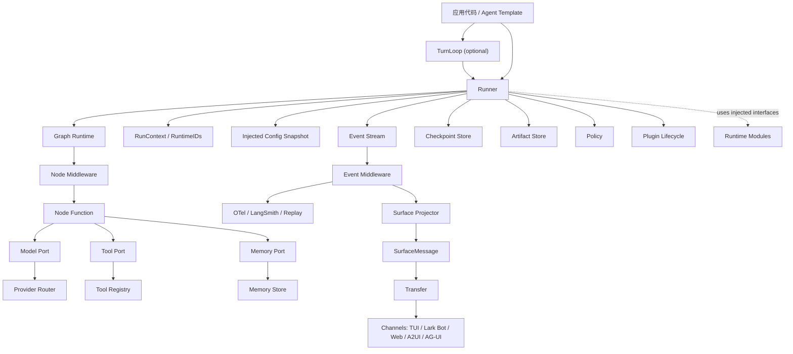
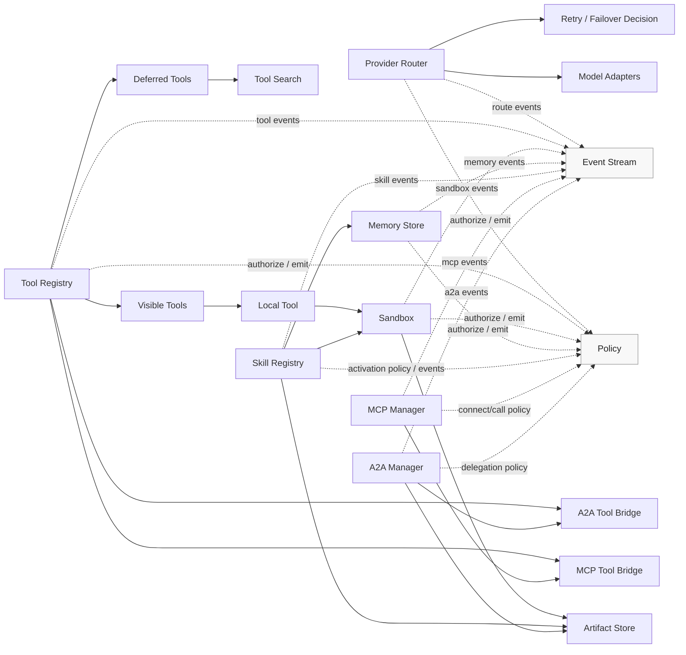
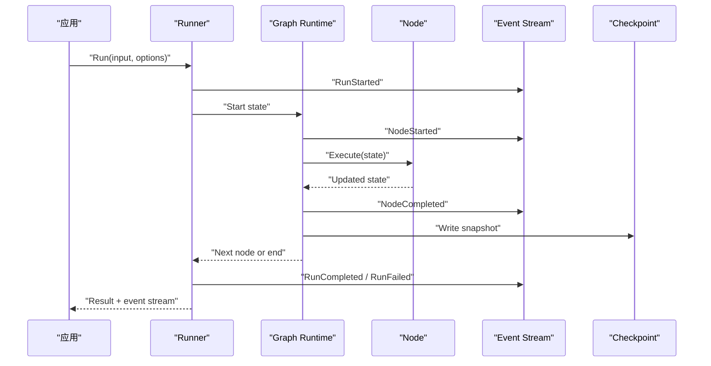
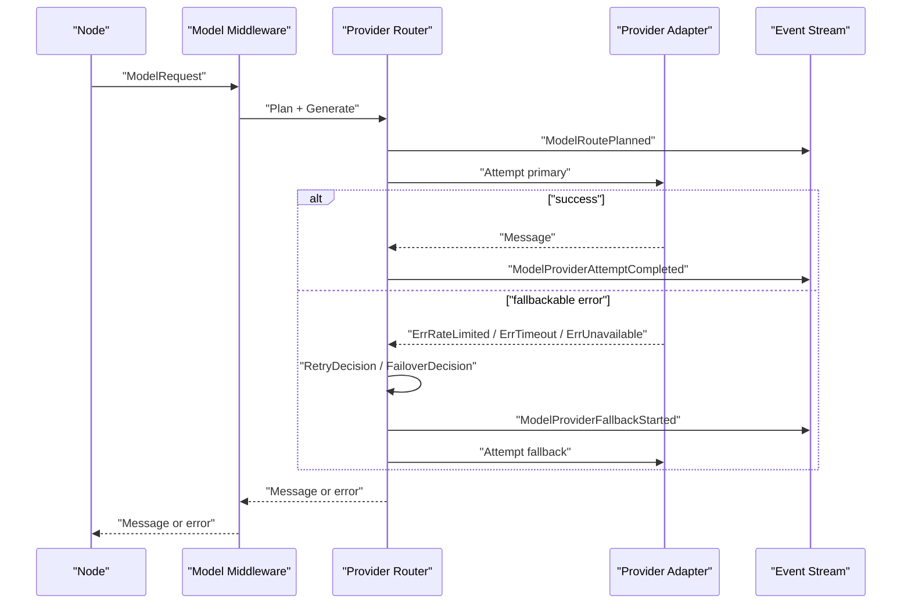
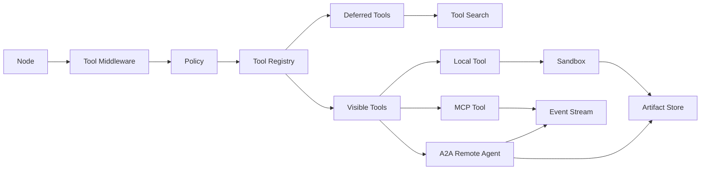
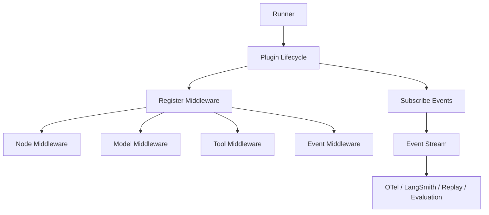
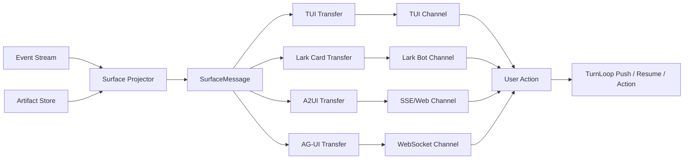

# gopact 总体设计

日期：2026-06-23

本文是 `docs/design` 的入口。它把设计哲学、运行时模块、扩展性模型和后续 milestone 整合成一张完整地图。

## 结论

`gopact` 的核心不是某个 agent template，也不是某个模型 provider adapter，而是一套可观察、可恢复、可测试、可替换的运行时契约。

最小可用运行时由五层组成：

1. foundational contracts：`Message`、`ContentPart`、`ToolSpec`、`ModelRequest`、`ModelRoute`、`Event`、`SurfaceMessage`、`CheckpointRecord`、`RuntimeIDs`、`ArtifactRef`、`PolicyDecision`、`ConfigVersion`。
2. execution spine：`TurnLoop`、`Runner`、event stream、graph execution、checkpoint、cancel、interrupt/resume。
3. runtime modules：provider routing、tool registry、sandbox、memory、skill、MCP、A2A。
4. extension layer：hook、node/model/tool/event middleware、runner plugin。
5. adapter/template layer：model/memory/sandbox/MCP/A2A/channel adapters、transfer、plugins，以及 ReAct、Agent-as-Tool、Dev Agent 等 graph template。

ReAct、planner、supervisor、多 agent、deep-agent 都应该是这套运行时之上的 graph template，而不是隐藏执行顺序的不透明 agent class。

## 文档地图

| 文档 | 职责 | 何时阅读 |
| --- | --- | --- |
| [philosophy.md](philosophy.md) | 项目级设计原则、core 边界、Go API 取舍 | 判断一个 API 或模块是否应该进入 core |
| [contracts.md](contracts.md) | `Message`、`ContentPart`、`RuntimeIDs`、`Event`、`SurfaceMessage`、`CheckpointRecord`、`ArtifactRef`、`PolicyDecision` 等基础契约 | 实现 M1 或修改可持久化/可序列化类型 |
| [events.md](events.md) | 事件分类、顺序、stream API、redaction、sink 失败策略、channel/OTel 映射 | 设计 event stream、观测、replay、trajectory test |
| [checkpoint-resume.md](checkpoint-resume.md) | checkpoint record、interrupt、resume、cancel-safe point、副作用幂等 | 设计恢复、HITL、TurnLoop、checkpoint store |
| [config.md](config.md) | typed option 注入、snapshot version、热替换、secret provider、adapter/module/plugin 配置 | 接入 provider、sandbox、MCP、A2A、plugin、transfer 或 channel |
| [security.md](security.md) | 信任边界、policy、redaction、sandbox、MCP/A2A、skill、channel 安全规则 | 设计任何外部动作、数据外发或权限扩大 |
| [channels.md](channels.md) | `SurfaceMessage`、transfer、channel adapter、Lark/TUI/A2UI 等展示接入 | 接入新的展示位置、bot、TUI、Web 或 IM channel |
| [modules.md](modules.md) | provider routing、tool registry、sandbox、memory、skill、MCP、A2A 的契约和默认实现要求 | 设计运行时核心模块或 adapter |
| [extensibility.md](extensibility.md) | hook、middleware、plugin 的分层、生命周期、错误语义 | 设计可扩展点和横切能力 |
| [templates.md](templates.md) | ReAct、Agent-as-Tool、Dev Agent 等 graph template 的边界和测试要求 | 设计 agent template 或自举 agent |

## 总体架构

Runner 不是一个“大容器”，也不拥有所有模块实现。它是一次 run 的编排器：接收应用输入，装配 graph、模块接口、事件流、checkpoint 和插件生命周期，然后推进执行。模块实现通过 Go options、typed snapshots 或接口注入，生产环境可以替换成 adapter。SDK 不读取配置文件；任何文件、环境变量或远程配置中心都属于应用层。

`TurnLoop` 位于 Runner 之上，负责多轮输入、抢占、取消和恢复。Runner 只执行一次 run；TurnLoop 决定什么时候启动、取消、恢复或合并下一次 run。这个分层避免 Runner 变成长期在线状态机。

### Runner 编排图



架构边界：

- `TurnLoop` 是多轮控制面，负责输入合并、抢占、取消、恢复和下一轮调度；它不直接执行 node。
- `Runner` 是单次 run 组合点，负责把 graph、模块能力、事件、checkpoint、policy 和插件装配起来。
- `Graph Runtime` 只负责类型化状态流转、节点执行、边选择和 checkpoint 时机。
- `Provider Router` 属于模型调用边界，负责多 provider、多模型、fallback、健康状态和预算控制。
- `Provider Router`、`Tool Registry`、`Sandbox`、`Memory`、`Skill`、`MCP`、`A2A` 是运行时核心模块，不是后置 plugin。
- `Event`、`SurfaceMessage`、`CheckpointRecord`、`ArtifactRef`、`PolicyDecision`、`ConfigVersion` 是基础契约；它们支撑所有模块，但不算业务运行时模块。
- `Middleware` 改变一次执行动作；`Plugin` 组合 runner 级横切能力；`Adapter` 接入外部系统。
- TUI、Lark bot、Web、A2UI、AG-UI 等属于 channel/transfer 层，消费 event stream、surface message 和 artifact refs；它们不是核心模块，也不能反向绑定 Runner。

### 模块依赖图



依赖规则：

- `Policy` 和 `Event Stream` 是共享横切能力，模块可以调用它们，但它们不能反向依赖具体模块。
- `Provider Router` 不依赖 graph、tool、sandbox、memory、MCP、A2A；它只依赖 provider adapter、模型能力目录、健康状态、policy 和事件。
- `Provider Router` 的 retry/failover 必须是显式 decision，而不是固定重试次数。Decision 可以读取失败 attempt 的输入、输出、错误、attempt 序号，并决定是否改写下一次输入或切换模型。
- `Tool Registry` 聚合本地工具、MCP tool bridge、A2A tool bridge；MCP/A2A 不是直接嵌进 graph，而是通过 tool 或 node adapter 暴露能力。
- `Tool Registry` 必须区分 visible tools 和 deferred tools。模型只能直接看到 visible tools；deferred tools 需要通过 tool search、skill activation 或 middleware 进入可见集合。
- `Sandbox` 只负责受控执行和文件边界，产物写入 `Artifact Store`；它不依赖 provider 或 memory。
- `Skill Registry` 可以使用 sandbox 执行脚本、读取 artifact 或写入 memory；如果 skill 声明 MCP server，应由 Runner/MCP Manager 完成连接，避免 skill 直接管理 MCP 生命周期。
- `Memory Store` 是长期记忆存取模块，不做自动模型抽取；抽取可以由 middleware/template 使用 provider router 后写入 memory。
- `A2A Manager` 可以产生 artifact，也可以把远程 agent 暴露为 tool/node adapter；它不能默认读取或发送本地 memory。

## 组件交互

### 多轮 TurnLoop 路径

```mermaid
sequenceDiagram
  participant App as "应用 / UI"
  participant Loop as "TurnLoop"
  participant Runner as "Runner"
  participant Checkpoint as "Checkpoint"
  participant Event as "Event Stream"

  App->>Loop: "Push(input)"
  Loop->>Runner: "Run(turn input)"
  Runner->>Event: "RunStarted"
  alt "higher priority input"
    App->>Loop: "Push(input, preempt=true)"
    Loop->>Runner: "Cancel current run"
    Runner->>Checkpoint: "Write cancel-safe checkpoint"
    Runner->>Event: "RunCanceled"
    Loop->>Runner: "Run(merged next input)"
  else "normal completion"
    Runner-->>Loop: "RunCompleted"
  end
  Loop-->>App: "Turn result / stream"
```

TurnLoop 要求：

- cancel 和 interrupt 是不同语义。cancel 是外部终止当前 run；interrupt 是业务流程主动暂停等待恢复输入。
- cancel 必须有安全点，取消失败可以升级，但不能悄悄丢 checkpoint。
- 恢复时，TurnLoop 要区分被中断的输入、尚未处理的输入和恢复后新输入。
- Runner 不维护长期输入队列；输入合并、去重、抢占都属于 TurnLoop。

### 一次 run 的主路径



主路径要求：

- 每个可观察行为都进入 event stream。
- checkpoint 写入发生在稳定状态边界。
- error 保留 wrapping，支持 `errors.Is` / `errors.As`。
- `RuntimeIDs` 贯穿 run、node、model、tool、sandbox、memory、MCP、A2A。

### 模型调用路径



模型路径要求：

- model routing 和 provider routing 分开建模。
- retry/failover 由显式 decision 触发，不能只靠固定次数或字符串匹配。
- fallback candidate 必须满足硬能力和 policy。
- decision 可以改写下一次模型输入，但必须产生事件并保留 attempt 轨迹。
- 同一 `ThreadID` 默认保持 session stickiness。
- 流式输出开始后默认不自动切换，除非 adapter 能证明可恢复。

### 工具和外部能力路径



工具路径要求：

- tool call 必须经过 tool middleware 和 policy。
- 模型默认只看到 visible tools；deferred tools 只能通过搜索、skill 激活或 middleware 显式提升。
- 本地命令、脚本、文件访问必须经过 sandbox。
- MCP 是 agent-to-tool/data/prompt 边界。
- A2A 是 agent-to-agent task/artifact 边界。
- 远程返回的 tool suggestion 不自动执行，必须回到本地 policy。

### 扩展路径



扩展路径要求：

- hook 是生命周期时点，不是主要用户 API。
- middleware 作用在具体执行边界。
- plugin 只通过注册 middleware、订阅事件、管理生命周期影响运行时。
- plugin 不能直接修改 graph 分支、checkpoint 核心字段或业务 state。

### Channel / transfer 路径



Channel / transfer 要求：

- `SurfaceMessage` 是统一展示语义，agent/runtime 不直接输出 Lark card、TUI line 或 A2UI payload；
- transfer 只做格式转换，不读取 Runner 内部状态；
- channel adapter 负责投递、更新、删除和接收用户动作；
- 用户交互只能作为新的 input、resume payload 或受控 action 回到 TurnLoop；
- channel 可以通过 plugin 注册 transfer、事件订阅和生命周期；
- interrupt、tool call/result、streaming message、artifact update 必须能映射到 channel。

## 包和职责

```text
gopact
  message.go
  content.go
  tool.go
  model.go
  event.go
  ids.go
  options.go
  turnloop.go
  runner.go
  middleware.go
  plugin.go

graph
  graph.go
  stream.go
  middleware.go

checkpoint
artifact
policy
provider
tools
sandbox
memory
skill
mcp
a2a

adapters/model/openai-compatible
adapters/model/openai
adapters/model/anthropic
adapters/memory/mem0
adapters/sandbox/docker
adapters/mcp/registry
adapters/a2a/http
adapters/transfer/a2ui
adapters/transfer/agui
adapters/transfer/lark
adapters/transfer/tui
adapters/channel/sse
adapters/channel/websocket
adapters/channel/lark
adapters/channel/tui

plugins/otel
plugins/langsmith
plugins/replay
plugins/evaluation
plugins/channel/larkbot
plugins/channel/tui

templates/react
templates/agentastool
templates/devagent
```

包边界规则：

- `gopact` root 只放跨模块核心契约和轻量 runtime facade。
- `Runner`、`TurnLoop`、middleware、plugin 的公开入口由 root package 暴露；早期不创建公开 `runner` 或 `turnloop` package。
- `graph` 保持类型化状态执行，不直接依赖具体 provider、sandbox、memory 后端。
- `artifact`、`policy`、`checkpoint` 是基础支撑 package；核心模块 package 定义 contract 和无外部依赖默认实现。
- adapter package 接入外部服务或格式转换，不反向污染 core contract。
- plugin package 管理横切能力，不承担业务编排。
- template package 只组合 graph/runtime，不定义新的执行语义。

## Milestones

模块清单是范围定义，不代表一次提交全部完成。实现需要按依赖顺序推进。

| Milestone | 目标 | 主要交付 | 自举状态 |
| --- | --- | --- | --- |
| M0: Design Baseline | 设计闭环 | `index.md`、哲学、核心契约、事件、checkpoint/resume、配置、安全、扩展性、模块、template 设计一致；README 指向设计入口 | 不能自举 |
| M1: Runtime Spine | 运行时可观察 | `ContentPart`、`RuntimeIDs`、`RunContext`、`ConfigVersion`、`ArtifactRef`、`PolicyDecision`、`SurfaceMessage`、`CheckpointRecord`、`graph.Run` event stream、node/checkpoint/error/cancel/interrupt 事件、event assertion helper | 不能自举，但可以用事件流验证样例 |
| M2: Model Spine | SDK 能稳定调用模型 | `provider.Registry`、`provider.Router`、fake provider、openai-compatible adapter、model route events、`RetryDecision`、`FailoverDecision`、错误分类、typed `RouteSet`、基础 cost/token metadata | 不能完整自举，但可以用 SDK 驱动模型生成设计草稿 |
| M3: Tool and Sandbox Spine | SDK 能安全执行 repo 内动作 | `tools.Registry`、visible/deferred tools、tool search、tool middleware、artifact store、sandbox local/memory、受限 file/shell tool、checkpoint 失败语义、基础安全测试 | 可以开始 Level 1 自举：只读分析、生成计划、运行受限测试；patch 生成/应用由当前运行模式决定 |
| M4: TurnLoop and Integration Spine | SDK 能处理多轮输入和外部能力 | `TurnLoop`、cancel/preempt、输入合并、恢复队列、skill registry、memory store、MCP client/server minimal、A2A client/server minimal、resource/prompt bridge | 可以开始 Level 2 自举：受控修改 docs、示例和测试；write mode 可 apply patch，plan mode 只输出 patch 建议 |
| M5: Agent Template and HITL | SDK 能跑真实开发 agent | ReAct graph template、Agent-as-Tool、Dev Agent template、interrupt/resume、human approval、trajectory tests、record/replay、OTel/LangSmith plugin、TUI channel plugin | 可以开始正式自举：用 gopact agent 处理低风险 issue、文档、测试和 adapter 骨架 |
| M6: Production Hardening | SDK 可被外部项目采用 | adapter 分拆、CI gates、compat tests、security policy、versioning、examples、release docs | 可以扩大自举范围：实现 core 小特性，但 release、权限扩大和破坏性修改仍需人工审批 |

### 自举定义

这里的自举不是让 agent 无监督地改自己，而是让 `gopact` 运行一个基于自身 runtime 的开发 agent 来维护 `gopact` 仓库。

自举分三级：

- Level 1：只读分析和计划生成。可以读取 repo、跑测试、输出 patch 建议；plan mode 不 apply patch，write mode 也只允许用户显式放行的低风险写入。
- Level 2：受控写入。可以修改 docs、examples、tests 和 adapter 骨架；write mode 可以 apply patch，但每次写入必须有 event、checkpoint、diff 和人工确认，plan mode 只输出 patch 建议。
- Level 3：日常开发协作。可以实现低风险 core 变更，但必须经过 trajectory test、unit test、vet、review 和人工 release gate。

最早可以开始自举的时间点是 M3 结束。M3 之前缺少安全执行边界和 tool policy，只能做普通模型调用，不能让 SDK 驱动开发任务。真正可作为日常开发助手使用的时间点是 M5 结束。

## 当前 review 结论

当前 `docs/design` 的分工如下：

- `philosophy.md` 定义为什么这样设计；
- `contracts.md`、`events.md`、`checkpoint-resume.md`、`config.md`、`security.md` 定义实现前必须稳定的基础契约和横切规则；
- `channels.md` 定义统一输出如何转换到 TUI、Lark bot、Web、A2UI、AG-UI 等展示位置；
- `modules.md` 定义运行时一开始必须具备哪些模块；
- `extensibility.md` 定义用户如何扩展运行时；
- `templates.md` 定义 agent template 如何建立在同一套 runtime 之上；
- 本文定义如何把它们组合起来，以及按什么顺序落地。

后续新增设计文档时，必须先更新本文的文档地图和 milestone 影响，再进入具体子文档。
